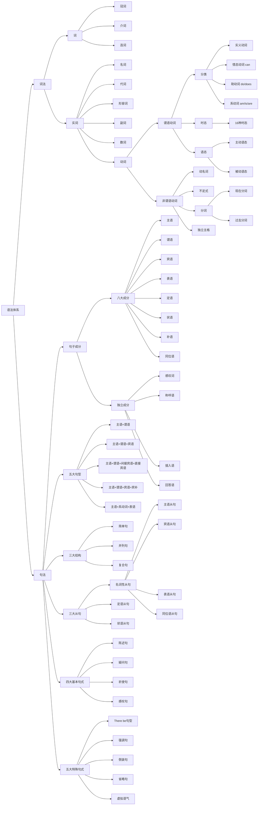

```mermaid
flowchart LR

    A[语法体系]

    A --> B[词法]
    A --> C[句法]

    %% 词法
    B --> D[词]
    B --> E[实词]

    D --> D1[冠词]
    D --> D2[介词]
    D --> D3[连词]

    E --> E1[名词]
    E --> E2[代词]
    E --> E3[形容词]
    E --> E4[副词]
    E --> E5[数词]
    E --> E6[动词]

    E6 --> F1[谓语动词]
    E6 --> F2[非谓语动词]

    F1 --> G1[分类]
    F1 --> G2[时态]
    F1 --> G3[语态]

    G1 --> G11[实义动词]
    G1 --> G12[情态动词 can]
    G1 --> G13[助动词 do/does]
    G1 --> G14[系动词 am/is/are]

    G2 --> G21[16种时态]

    G3 --> G31[主动语态]
    G3 --> G32[被动语态]

    F2 --> H1[动名词]
    F2 --> H2[不定式]
    F2 --> H3[分词]
    F2 --> H4[独立主格]

    H3 --> H31[现在分词]
    H3 --> H32[过去分词]

    %% 句法
    C --> I[句子成分]
    C --> J[五大句型]
    C --> K[三大结构]
    C --> L[三大从句]
    C --> M[四大基本句式]
    C --> N[五大特殊句式]

    %% 句子成分
    I --> I1[八大成分]
    I --> I2[独立成分]

    I1 --> I11[主语]
    I1 --> I12[谓语]
    I1 --> I13[宾语]
    I1 --> I14[表语]
    I1 --> I15[定语]
    I1 --> I16[状语]
    I1 --> I17[补语]
    I1 --> I18[同位语]

    I2 --> I21[感叹词]
    I2 --> I22[称呼语]
    I2 --> I23[插入语]
    I2 --> I24[回答语]

    %% 五大句型
    J --> J1[主语+谓语]
    J --> J2[主语+谓语+宾语]
    J --> J3[主语+谓语+间接宾语+直接宾语]
    J --> J4[主语+谓语+宾语+宾补]
    J --> J5[主语+系动词+表语]

    %% 三大结构
    K --> K1[简单句]
    K --> K2[并列句]
    K --> K3[复合句]

    %% 三大从句
    L --> L1[名词性从句]
    L --> L2[定语从句]
    L --> L3[状语从句]

    L1 --> L11[主语从句]
    L1 --> L12[宾语从句]
    L1 --> L13[表语从句]
    L1 --> L14[同位语从句]

    %% 四大基本句式
    M --> M1[陈述句]
    M --> M2[疑问句]
    M --> M3[祈使句]
    M --> M4[感叹句]

    %% 五大特殊句式
    N --> N1[There be句型]
    N --> N2[强调句]
    N --> N3[倒装句]
    N --> N4[省略句]
    N --> N5[虚拟语气]
```