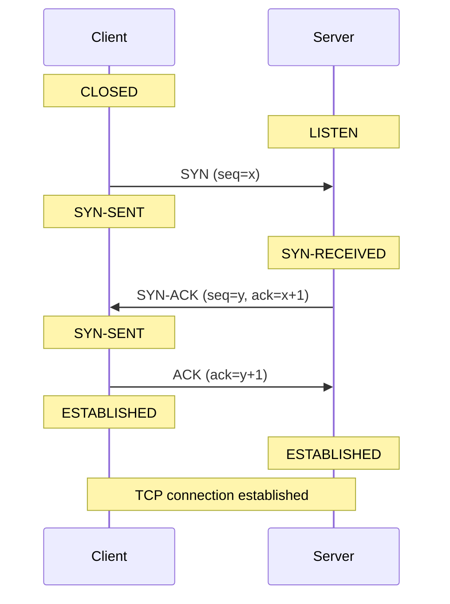
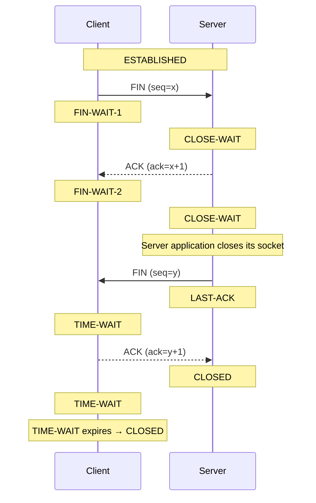

## Definition

TCP (Transmission Control Protocol) is a transport-layer protocol that provides reliable, ordered, and error-checked data delivery between applications over an IP network.

TCP provides:

- **Connection establishment:** Establishes a logical connection before data transfer.
    
- **Reliable delivery:** Uses acknowledgments and retransmissions to recover from packet loss.
    
- **Ordered delivery:** Reassembles data in the correct sequence.
    
- **Flow control:** Prevents a sender from overwhelming the receiver.
    
- **Congestion control:** Adjusts transmission behavior according to network conditions.
    
- **Full-duplex communication:** Allows both sides to send and receive data independently.

TCP does not guarantee that the application itself is healthy or that the remote application is processing requests successfully. A TCP connection can be established even when the application is overloaded or unable to handle business requests.

## Three-Way Handshake

The three-way handshake establishes a TCP connection between a client and server.



### Step 1 — SYN

The client sends a `SYN` segment to request a TCP connection.

The client changes:

```text
CLOSED → SYN-SENT
```

The SYN segment is used to:

- Request a TCP connection.
    
- Synchronize sequence numbers.
    
- Communicate the client's initial sequence number (ISN).

Example:

```text
SYN
seq = 1000
```

### Step 2 — SYN-ACK

The server receives the SYN and responds with `SYN-ACK`.

```text
Client                         Server
  |                               |
  |-------- SYN, seq=1000 ------->|
  |                               |
  |<------- SYN-ACK --------------|
  |         seq=5000              |
  |         ack=1001              |
```

The server changes:

```text
LISTEN → SYN-RECEIVED
```

The response contains:

```text
SYN
seq = 5000

ACK
ack = 1001
```

Why `x + 1`?

Because a SYN consumes one sequence number.

For example:

```text
Client SYN:
seq = 1000

Server SYN-ACK:
ack = 1001
```

This means:

> I acknowledge your SYN and expect the next sequence number to be 1001.

### Step 3 — ACK

The client sends the final ACK.

The client enters:

```text
SYN-SENT → ESTABLISHED
```

The server enters:

```text
SYN-RECEIVED → ESTABLISHED
```

The client considers the connection established when it sends the final ACK. The server considers it established when it receives that ACK.

The connection is now ready for data transfer.

## Four-Way TCP Termination

TCP normally uses four segments to terminate a connection because TCP is full-duplex.

Each direction of data transmission can be closed independently:

```text
Client → Server

Server → Client
```

Closing one direction does not automatically close the other direction.

The following diagram illustrates a typical termination sequence in which the client initiates the close and the server responds later.



### Step 1 — FIN

The client finishes sending data and initiates a graceful shutdown of its sending direction.

It sends:

```text
FIN
```

The client changes:

```text
ESTABLISHED → FIN-WAIT-1
```

When the server receives the FIN, its TCP state changes:

```text
ESTABLISHED → CLOSE-WAIT
```

The server has received an indication that the client will send no more data.

The server may still send data to the client because TCP is full-duplex.

### Step 2 — ACK

The server's TCP stack acknowledges the FIN.

```text
ACK
ack = x + 1
```

The client changes:

```text
FIN-WAIT-1 → FIN-WAIT-2
```

The server remains in:

```text
CLOSE-WAIT
```

This means:

> The remote side has closed its sending direction, but the local application has not necessarily closed its socket.

The ACK is normally generated automatically by the TCP stack. The application does not need to send the ACK itself.

### Step 3 — Server FIN

When the server application is ready to close its sending direction, it closes the socket or otherwise initiates a graceful shutdown.

The server sends its own FIN:

```text
CLOSE-WAIT → LAST-ACK
```

The client receives the FIN and changes:

```text
FIN-WAIT-2 → TIME-WAIT
```

### Step 4 — Final ACK

The client acknowledges the server's FIN.

The server changes:

```text
LAST-ACK → CLOSED
```

The client remains in:

```text
TIME-WAIT
```

After the TIME-WAIT timer expires, the client transitions to:

```text
TIME-WAIT → CLOSED
```

TIME-WAIT helps ensure that delayed segments from an old connection do not interfere with a subsequent connection using the same socket endpoints.

### Important notes

- The four-segment exchange is the usual case, not an absolute rule.
    
- An ACK and FIN can be combined into one TCP segment.
    
- Both sides can initiate closure at nearly the same time. This is called simultaneous close and can involve the `CLOSING` state.
    
- An abrupt close, such as an application aborting a socket or a system failure, may produce a TCP reset (RST) instead of a graceful FIN exchange.

## TCP States

TCP defines 11 connection states.

|#|TCP state|Meaning|
|---|---|---|
|1|`CLOSED`|No active TCP connection exists.|
|2|`LISTEN`|Waiting for incoming connection requests.|
|3|`SYN-SENT`|SYN sent; waiting for a response.|
|4|`SYN-RECEIVED`|SYN received and SYN-ACK sent; waiting for the final ACK.|
|5|`ESTABLISHED`|Connection is established and data can be transferred.|
|6|`FIN-WAIT-1`|Local side sent FIN and is waiting for an ACK or the peer's FIN.|
|7|`FIN-WAIT-2`|Local FIN was acknowledged; waiting for the peer's FIN.|
|8|`CLOSE-WAIT`|Peer sent FIN; local side has not completed its close.|
|9|`CLOSING`|Both sides sent FIN before the local FIN was acknowledged; waiting for an ACK.|
|10|`LAST-ACK`|Local side sent FIN after receiving the peer's FIN; waiting for the final ACK.|
|11|`TIME-WAIT`|Waiting before fully releasing the connection state.|

### LISTEN

The application has a listening TCP socket waiting for incoming connection requests.

Example:

```text
0.0.0.0:8080
```

This means the socket is bound to all local IPv4 addresses on port 8080.

Useful for checking:

- Whether a TCP port is listening.
    
- Whether a service is bound to the expected address.
    
- Whether a service may be accepting incoming connections.

A listening socket does not necessarily mean the application is healthy or that requests can be processed successfully.

### ESTABLISHED

The TCP connection is established.

Example:

```text
Local Address       Peer Address
10.10.1.10:8080     10.10.1.20:52341
```

A high number of established connections may indicate:

- High traffic.
    
- Many concurrent clients.
    
- Long-lived connections.
    
- Connection leaks.
    
- Application or connection-pool design issues.

The count alone does not indicate a problem.

### TIME-WAIT

The connection is in the final waiting state after the local TCP endpoint has actively closed the connection or participated in simultaneous close.

A large number can occur when:

- A server frequently handles short-lived connections.
    
- The local host frequently performs the active close.
    
- Applications frequently create new TCP connections.

A large TIME-WAIT count is not inherently abnormal.

Investigate whether it is:

- Increasing continuously.
    
- Contributing to ephemeral-port exhaustion.
    
- Associated with failed outbound connections.
    
- Consuming significant kernel resources.

TIME-WAIT sockets are managed by the TCP stack and do not necessarily correspond to open file descriptors held by the application.

### CLOSE-WAIT

The local TCP stack has received a FIN from the remote endpoint and acknowledged it, but the local application has not completed its side of the connection closure.

Typical sequence:

```text
Remote sends FIN
       ↓
Local TCP stack receives FIN
       ↓
Local TCP stack sends ACK
       ↓
Local TCP state becomes CLOSE-WAIT
       ↓
Local application closes its socket
       ↓
Local TCP stack sends FIN
       ↓
State becomes LAST-ACK
```

CLOSE-WAIT is particularly useful for investigating possible application-side connection leaks.

A high or continuously increasing count may indicate:

- Socket-closing logic is missing or incorrect.
    
- Application code is blocked before reaching the cleanup logic.
    
- An exception or error path bypasses resource cleanup.
    
- Connection-pool or network-library cleanup is malfunctioning.
    
- The application is overloaded and cannot process or release connections promptly.

However, CLOSE-WAIT is not inherently an error. Some connections may remain in this state temporarily while the application finishes processing data or performing cleanup.

**Important:** CLOSE-WAIT does not mean the ACK was never sent. The TCP stack normally sends the ACK automatically. It also does not prove that the application has exhausted file descriptors, memory, threads, or database connections.

### SYN-SENT

The local machine has sent a SYN but has not yet received the expected SYN-ACK.

Possible causes include:

- Remote server unavailable.
    
- Firewall dropping packets.
    
- Network connectivity problems.
    
- Incorrect routing.
    
- Remote port not responding.
    
- Packet loss or remote overload.

A large or persistent SYN-SENT count can indicate outgoing connection problems.

### SYN-RECEIVED

The server received a SYN and sent a SYN-ACK but has not yet received the final ACK.

Possible causes include:

- Network packet loss.
    
- Client problems.
    
- Firewall behavior.
    
- SYN-flood attacks.
    
- Connection backlog pressure.

A high count should be investigated alongside the server's listen backlog, network traffic, and kernel TCP metrics.
### How to count TCP connections

#### 1. Show all TCP sockets

```bash
ss -ant
```

The `-a` option includes listening and non-listening sockets, and `-n` avoids resolving addresses and ports into names.

#### 2. Show only listening TCP sockets

```bash
ss -lnt
```

#### 3. Show sockets in a specific TCP state

```bash
ss -Htan state close-wait
```

For example:

```bash
ss -Htan state established
ss -Htan state time-wait
ss -Htan state syn-sent
ss -Htan state syn-recv
```

Linux `ss` uses `syn-recv` as the state filter. Its displayed state names may differ from the formal TCP state names; for example, established connections are commonly displayed as `ESTAB`.

#### 4. Count TCP sockets by state

```bash
ss -Htan | awk '{print $1}' | sort | uniq -c | sort -nr
```

Example output:

```text
1500 ESTAB
 800 TIME-WAIT
 120 CLOSE-WAIT
   5 LISTEN
   2 SYN-SENT
```

This counts TCP sockets reported by `ss`, including listening sockets. It is a useful overview but does not count only active connections.

To count non-listening sockets by state, use:

```bash
ss -Htan state established | wc -l
ss -Htan state time-wait | wc -l
ss -Htan state close-wait | wc -l
ss -Htan state syn-sent | wc -l
ss -Htan state syn-recv | wc -l
```

#### 5. Count connections by local IP for a specific TCP state

```bash
tcp_status=established

ss -Htan state "$tcp_status" |
awk '{print $4}' |
sed -E 's/:[0-9]+$//' |
sort |
uniq -c |
sort -nr |
head -20
```

Example output:

```text
500 10.10.1.20
300 10.10.1.21
120 10.10.1.22
```

This removes the port from the local endpoint and groups the remaining addresses.

For IPv6, endpoint formatting varies by output and should be checked before relying on this parsing method in automation.

#### 6. Count connections by local IP and port for a specific TCP state

```bash
tcp_status=established

ss -Htan state "$tcp_status" |
awk '{print $4}' |
sort |
uniq -c |
sort -nr |
head -30
```

Example output:

```text
500 10.10.1.20:8080
300 10.10.1.20:8443
120 10.10.1.20:3306
```

This is useful for identifying local ports with large numbers of connections.

#### 7. Count TCP sockets by local IP and port across all states

```bash
ss -Htan |
awk '{print $4}' |
sort |
uniq -c |
sort -nr |
head -20
```

Example output:

```text
1200 10.10.1.20:8080
 800 10.10.1.20:8443
 300 10.10.1.20:3306
```

This includes listening sockets and connections in different states, so interpret the results accordingly.

#### 8. Identify the processes holding CLOSE-WAIT sockets

```bash
sudo ss -antp state close-wait
```

The process information may require root privileges.

To summarize sockets by owning process, if `lsof` is installed:

```bash
sudo lsof -nP -iTCP -sTCP:CLOSE_WAIT
```

Review the process name, PID, local address, and peer address to identify the affected application and its connections.

## Potential Causes of Abnormal Application Connection Closure

A high CLOSE-WAIT count can be associated with an application failing to close sockets correctly. The underlying cause may be a coding problem, a blocked execution path, or a resource bottleneck.

### 1. Missing socket cleanup

Application code opens a socket but does not close it on every execution path.

For example:

```text
Open socket
    ↓
Process request
    ↓
Exception occurs
    ↓
Return early without closing socket
```

The connection can remain in CLOSE-WAIT after the remote endpoint sends FIN.

**Prevention:** Use structured resource management, such as Java try-with-resources, Go `defer conn.Close()`, or the appropriate cleanup mechanism in the application's networking library.

### 2. Exceptions and error-handling defects

An exception may interrupt normal processing before the cleanup logic runs.

Potential scenarios:

- An exception is caught and ignored.
    
- An early return bypasses cleanup.
    
- A timeout path forgets to release a resource.
    
- A cleanup operation itself fails.
    
- An asynchronous callback never executes its completion logic.

**Investigation:** Review error logs and code paths around the time the CLOSE-WAIT count increases.

### 3. Blocked or stalled application threads

An application thread may be blocked on a network read, lock, downstream service, or other operation.

If socket cleanup occurs only after the operation completes, the socket may remain open.

Possible causes include:

- Deadlocks.
    
- Long-running database queries.
    
- Unbounded waits.
    
- Missing read or connection timeouts.
    
- Thread-pool exhaustion.
    
- Slow downstream services.

**Investigation:** Inspect thread dumps, request queues, operation timeouts, and the application's thread-pool metrics.

Note that a CLOSE-WAIT socket does not necessarily have a dedicated thread blocked on it. The relationship depends on the application's design.

### 4. Connection-pool problems

Applications often use connection pools for databases, HTTP clients, or other services.

Potential problems include:

- Connections not returned to the pool.
    
- Improper cleanup of failed connections.
    
- Connection-pool limits being too low for the workload.
    
- Pool maintenance or eviction logic malfunctioning.
    
- Application code holding resources longer than necessary.

A pool can be exhausted even if the process has plenty of file descriptors remaining.

A CLOSE-WAIT socket does not automatically imply a database connection leak. Confirm that the socket belongs to the relevant downstream connection and correlate it with pool metrics.

### 5. Missing or inappropriate timeouts

Without appropriate timeouts, application operations may wait indefinitely.

Useful timeout categories include:

- TCP connection timeout.
    
- Socket read timeout.
    
- HTTP request timeout.
    
- Database query timeout.
    
- Connection-pool acquisition timeout.
    
- Application request deadline.

A timeout can limit how long an operation waits, but it must be paired with correct resource cleanup. Configuring a timeout alone does not guarantee that sockets will be closed properly.

### 6. Application overload

An overloaded application may have difficulty processing requests and releasing resources promptly.

Possible symptoms include:

- CPU saturation.
    
- High garbage-collection overhead.
    
- Memory pressure.
    
- Thread-pool exhaustion.
    
- Request queue growth.
    
- Slow database or downstream calls.

Overload can contribute to a growing CLOSE-WAIT count, but the count itself does not prove that overload is the root cause.

### 7. Process or library lifecycle problems

A network library or application component may mishandle socket closure during shutdown, reconnects, cancellation, or error recovery.

Examples include:

- Incorrect asynchronous connection lifecycle management.
    
- Callbacks that fail to release resources.
    
- Improper shutdown of HTTP clients.
    
- Defects in third-party networking libraries.
    
- Application components that retain references to obsolete connections.

Investigate the application's networking implementation and library-specific diagnostics.

### 8. File descriptor exhaustion

Each socket generally consumes one file descriptor in the process that owns it.

If CLOSE-WAIT sockets accumulate, they may contribute to reaching the process's open-file limit.

When the limit is reached, operations that need new file descriptors can fail, potentially preventing new network connections, file access, or request handling.

However, a CLOSE-WAIT count of 1,000 does not prove that the FD limit has been reached.

Check the actual process usage and limit:

```bash
PID=<application_pid>

grep -i "open files" /proc/$PID/limits
ls /proc/$PID/fd | wc -l
```

Also investigate application errors such as:

```text
Too many open files
```

### 9. Memory and kernel resource pressure

Open sockets consume kernel resources, and application code may retain memory associated with connections.

Potential problems include:

- Kernel socket memory pressure.
    
- Excessive socket buffering.
    
- Application objects retained by leaked connections.
    
- Java heap pressure or excessive garbage collection.
    
- General system memory exhaustion.

A socket in CLOSE-WAIT does not necessarily consume a large amount of memory. Measure memory usage before concluding that these sockets are responsible.

### 10. Resource exhaustion elsewhere

The application may fail even when FD usage is below its limit.

Other possible bottlenecks include:

- Database connection-pool exhaustion.
    
- HTTP client connection-pool exhaustion.
    
- Worker or thread-pool exhaustion.
    
- Application request queue saturation.
    
- Outbound ephemeral-port exhaustion.
    
- CPU saturation or memory pressure.
    

These are separate resource limits and should be checked independently.

## TCP State Monitoring Strategy

For general Linux monitoring, the following states are especially useful:

|TCP state|Monitoring purpose|When to investigate|
|---|---|---|
|`ESTABLISHED`|Connection load|Unexpected growth or application capacity issues|
|`TIME-WAIT`|Connection churn|Ephemeral-port pressure or unusual growth|
|`CLOSE-WAIT`|Peer-initiated closure awaiting local cleanup|Persistent or increasing count|
|`SYN-SENT`|Outgoing connection establishment|Persistent unanswered connection attempts|
|`SYN-RECV`|Incoming connection establishment|Unusual growth or backlog pressure|

### Normal and healthy states

```text
LISTEN
ESTABLISHED
TIME-WAIT
```

These states are not inherently abnormal.

### States worth investigating

```text
CLOSE-WAIT
SYN-SENT
SYN-RECV
```

Investigate when their counts are unusually high, persist longer than expected, or grow continuously.

### Common problem patterns

**CLOSE-WAIT increases continuously**

Possible causes: missing socket cleanup, blocked application execution paths, connection lifecycle bugs, or resource pressure.

**SYN-SENT increases continuously**

Possible causes: remote service unavailability, packet filtering, routing problems, or connection establishment timeouts.

**SYN-RECV increases continuously**

Possible causes: client/network issues, backlog pressure, or a SYN-flood attack.

**TIME-WAIT increases significantly**

Possible causes: high rates of short-lived connections or ephemeral-port pressure.

## FAQ

#### Q1. Why is the TCP handshake three-way instead of two-way

Because both sides need to confirm that they can communicate and synchronize their TCP sequence numbers.

The three steps are:

```text
Client                         Server

SYN ──────────────────────────>
     <────────────────── SYN-ACK
ACK ──────────────────────────>
```

The server needs to receive the client's final `ACK` before the connection is fully established.

In simplified terms:

```text
SYN
↓
"I want to connect."

SYN-ACK
↓
"I received your request, and I can communicate with you."

ACK
↓
"I received your response. The connection is established."
```

#### Q2. Why does SYN consume one sequence number

`SYN` and `FIN` each consume one sequence number even though they don't contain application data.

For example:

```text
Client:
SYN seq=1000

Server:
ACK ack=1001
```

The server expects the next sequence number to be:

```text
1000 + 1 = 1001
```

The same principle applies to `FIN`.

#### Q3. Why does TCP termination normally require four packets

Because TCP is **full-duplex**.

There are logically two independent directions:

```text
Client ────────────────> Server
       data direction 1

Client <──────────────── Server
       data direction 2
```

Each side needs to close its own sending direction.

Therefore:

```text
Client                         Server

FIN ──────────────────────────>
     <────────────────── ACK
     <────────────────── FIN
ACK ──────────────────────────>
```

However, TCP can sometimes combine an `ACK` and `FIN`, so you may see fewer than four actual packets.
#### Q4. What is the difference between close-wait and time-wait

This is one of the most important distinctions.

`CLOSE-WAIT`

The **peer has closed its sending side**, but the local application has not closed its socket yet.

```text
Remote
  │
  │ FIN
  ▼
Local
  │
  │ CLOSE-WAIT
  ▼
Waiting for local application to close
```

A continuously increasing `CLOSE-WAIT` count can indicate an application problem.

`TIME-WAIT`

The local side has already completed the connection termination and is waiting before completely removing the connection.

```text
FIN
 ↓
ACK
 ↓
FIN
 ↓
ACK
 ↓
TIME-WAIT
 ↓
CLOSED
```

`TIME-WAIT` is normal TCP behavior.

#### Q5. Is a high number of  TIME-WAIT connections a problem

Not necessarily.

For example:

```text
20000 TIME-WAIT
```

does not automatically mean something is wrong.

A server handling many short-lived connections can naturally create many `TIME-WAIT` sockets.

You should be more concerned if:

```text
TIME-WAIT keeps increasing
        +
ephemeral ports are being exhausted
        +
new connections start failing
```

So the important question is not:

> Is `TIME-WAIT` high?

but:

> Is `TIME-WAIT` causing a resource problem?

#### Q6. Is a high number of ESTABLISHED connections a problem

Not necessarily.

`ESTABLISHED` simply means the TCP connections are active.

For example:

```text
10000 ESTABLISHED
```

could be perfectly normal for a busy web server.

You should compare the number against:

- Normal traffic
    
- Server capacity
    
- Application configuration
    
- Connection pool size
    
- Historical values

A sudden increase may be more meaningful than the absolute number.

#### Q7. Why is CLOSE-WAIT more suspicious than TIME-WAIT

Because `CLOSE-WAIT` usually means the remote side has already closed its connection, but the local application has not finished closing its socket.

For example:

```text
Remote                         Local

FIN ──────────────────────────>
     <────────────────── ACK
                              CLOSE-WAIT
```

If the application properly handles the connection closure, it should eventually send its own `FIN`

If many connections remain in:

```text
CLOSE-WAIT
```

the application may have a socket/resource leak.

#### Q8. What does SYN-SENT mean

`SYN-SENT` means:

> The local machine sent a SYN and is waiting for the remote side's SYN-ACK.

Example:

```text
Client                         Server

SYN ──────────────────────────>
             waiting...
```

If `SYN-SENT` connections remain for a long time, investigate:

- Network connectivity
    
- Routing
    
- Firewall rules
    
- Remote server availability
    
- Remote port availability
    
- Packet filtering

#### Q9. What does SYN-RECV mean

`SYN-RECV` means:

> The server received a SYN and sent a SYN-ACK, but it has not received the client's final ACK yet.

```text
Client                         Server

SYN ──────────────────────────>
     <────────────────── SYN-ACK
                              SYN-RECV
```

A small number is normal.

A very large number can indicate:

- Network problems
    
- Client problems
    
- Backlog pressure
    
- Firewall behavior
    
- SYN-flood activity

#### Q10. Does TIME-WAIT mean the connection is still usable

No.

A `TIME-WAIT` socket represents a connection that has already been terminated.

It is kept temporarily by the TCP stack for protocol correctness.

Therefore:

```text
ESTABLISHED
```

means the connection is active, while:

```text
TIME-WAIT
```

means the connection has already been closed but is being retained temporarily.

#### Q11. Why Does TIME-WAIT Exist

`TIME-WAIT` is important for TCP reliability.

The client does not immediately disappear after sending the final ACK.

Instead:

```text
TIME-WAIT → CLOSED
```

after waiting for a period of time.

The purpose is mainly to:

1. Allow delayed packets from the old connection to expire.
    
2. Ensure the final ACK can be retransmitted if necessary.

Without `TIME-WAIT`, delayed packets from an old connection could potentially interfere with a new connection using the same address/port combination.

> [!important]  
> `TIME-WAIT` is **not necessarily a problem**.
> 
> A large number of `TIME-WAIT` connections can be normal on servers that create many short-lived TCP connections.


Explain "Allow delayed packets from the old connection to expire"

Suppose we have:

```
Client                         Server
10.0.0.1:50000                 10.0.0.2:80
```

The TCP connection is identified by this 4-tuple:

```
10.0.0.1:50000 → 10.0.0.2:80
```

1. The old connection

Imagine they communicate:

```
Client                              Server

10.0.0.1:50000                     10.0.0.2:80
      │─────── Packet A ───────────────->│
      │─────── Packet B ───────────────->│
      │<──────────── FIN ────────────────│
      │──────────── ACK ───────────────->│
```

The connection is now being closed.

But here's the problem:

**What if Packet B was delayed somewhere in the network?**

For example:

```
Client                              Server

Packet B ────────────────X─────────────> 
                         │
                      delayed
                         │
                         ▼
                  arrives much later
```

The old packet hasn't disappeared just because the TCP connection closed.

2. Now imagine there is NO `TIME-WAIT`

The client immediately creates another TCP connection using the **same IP and port**:

```
OLD CONNECTION

10.0.0.1:50000 → 10.0.0.2:80
        │
        │ closed
        ▼

NEW CONNECTION

10.0.0.1:50000 → 10.0.0.2:80
```

Notice something important:

**The 4-tuple is exactly the same.**

Now the delayed Packet B from the **old connection** arrives:

```
                 OLD delayed packet
                        │
                        ▼
Client ───────────────────────────────> Server
10.0.0.1:50000                       10.0.0.2:80
                                         │
                                         │
                              "Which connection
                               does this belong to?"
```

The server sees:

```
10.0.0.1:50000 → 10.0.0.2:80
```

But that's also the new connection!

So an old packet could potentially be mistaken for a packet belonging to the new connection.

3. `TIME-WAIT` solves this

This is why TCP doesn't immediately forget the old connection.

After closing, one side enters:

```
TIME-WAIT
```

For example:

```
OLD CONNECTION

10.0.0.1:50000 → 10.0.0.2:80
        │
        │ close
        ▼
    TIME-WAIT
        │
        │ wait
        │
        │ old packets have time to disappear
        ▼
      CLOSED
```

During TIME-WAIT, the system essentially says:

> **"I'm not going to immediately reuse this exact connection identity. I'll wait for a while so that old packets have time to expire."**

Then, after the waiting period:

```
OLD CONNECTION
      │
      ▼
 TIME-WAIT
      │
      │ wait
      ▼
   CLOSED
      │
      ▼
NEW CONNECTION
```

Now the possibility of an old delayed packet interfering with the new connection is greatly reduced.

4. The key idea

The important concept isn't really **"TCP waits before closing."**

It's:

> **Packets can survive in the network after the connection that created them has been closed.**

Therefore:

```
Connection closed
       │
       │ doesn't mean
       ▼
all old packets immediately disappear
```

That's the reason for TIME-WAIT.

Think of TIME-WAIT as a "cool-down period"

```
OLD CONNECTION
      │
      │ FIN / ACK
      ▼
  TIME-WAIT
      │
      │ "Let's wait until
      │  old packets are gone."
      ▼
   CLOSED
      │
      ▼
  Safe to reuse
```

This is also why, when you're troubleshooting Linux with:

```
ss -ant
```

you may see many connections like:

```
TIME-WAIT
TIME-WAIT
TIME-WAIT
TIME-WAIT
```

They aren't active connections. They're **recently closed TCP connections that are being kept around temporarily to prevent exactly this kind of problem**.
