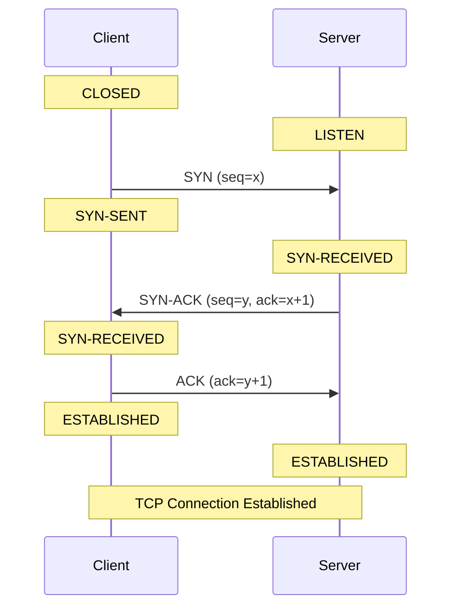
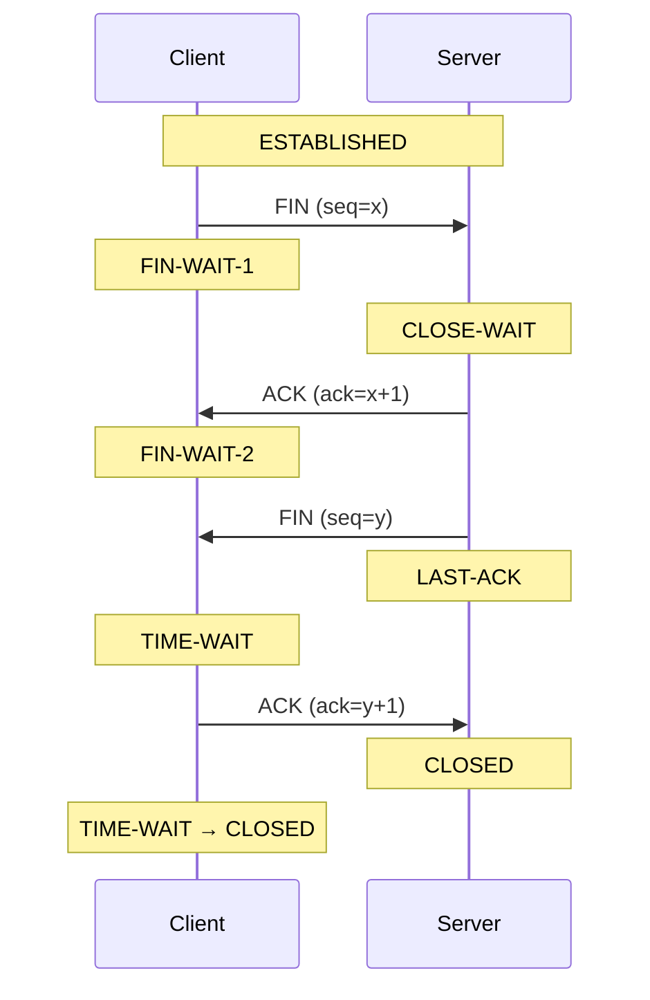

# TCP Connection Lifecycle

> [!summary] Overview  
> TCP is a **connection-oriented** protocol. A TCP connection is established through a **three-way handshake** and normally terminated through a **four-way FIN exchange**.
> 
> The Linux `ss` command can be used to observe TCP connections and their current states.

---

## 1. TCP Connection Lifecycle

The basic TCP lifecycle is:

```text
             Three-way handshake
                    │
                    ▼
             ┌─────────────┐
             │ ESTABLISHED │
             └─────────────┘
                    │
                    │  Four-way termination
                    ▼
             ┌─────────────┐
             │  TIME-WAIT  │
             └─────────────┘
                    │
                    ▼
                CLOSED
```

A simplified lifecycle is:

```text
CLOSED
  │
  │ SYN
  ▼
SYN-SENT
  │
  │ SYN-ACK
  ▼
ESTABLISHED
  │
  │ FIN
  ▼
FIN-WAIT-1
  │
  │ ACK
  ▼
FIN-WAIT-2
  │
  │ FIN
  ▼
TIME-WAIT
  │
  ▼
CLOSED
```

The actual state transitions depend on which side initiates the connection and how the connection is terminated.

---

# 2. Three-Way Handshake

The three-way handshake establishes a TCP connection between a client and server.



## 2.1 Step 1 — SYN

The client sends a `SYN` packet to the server.

```text
Client                         Server
  │                              │
  │──── SYN, seq=x ────────────>│
  │                              │
```

The client changes:

```text
CLOSED → SYN-SENT
```

The SYN packet is used to:

- Request a TCP connection
    
- Synchronize sequence numbers
    
- Tell the server the client's initial sequence number
    

Example:

```text
SYN
seq = 1000
```

---

## 2.2 Step 2 — SYN-ACK

The server receives the SYN and responds with `SYN-ACK`.

```text
Client                         Server
  │                              │
  │──── SYN, seq=1000 ─────────>│
  │                              │
  │<── SYN-ACK ─────────────────│
  │    seq=5000                  │
  │    ack=1001                  │
  │                              │
```

The server changes:

```text
LISTEN → SYN-RECEIVED
```

The server's response contains:

```text
SYN
seq = y

ACK
ack = x + 1
```

Why `x + 1`?

Because the `SYN` consumes one sequence number.

For example:

```text
Client SYN:
seq = 1000

Server:
ack = 1001
```

This means:

> "I received your SYN with sequence number 1000, and I expect the next sequence number to be 1001."

---

## 2.3 Step 3 — ACK

The client sends the final ACK.

```text
Client                         Server
  │                              │
  │──── SYN ───────────────────>│
  │<── SYN-ACK ─────────────────│
  │──── ACK, ack=y+1 ──────────>│
  │                              │
```

The client changes to:

```text
ESTABLISHED
```

The server also changes to:

```text
ESTABLISHED
```

The TCP connection is now ready for data transfer.

---

# 3. Why Three Packets?

The three-way handshake allows both sides to confirm that:

1. The client can send packets to the server.
    
2. The server can send packets to the client.
    
3. Both sides agree on the initial sequence numbers.
    

In simplified form:

```text
Client                              Server

  SYN ──────────────────────────────>

      <──────────────────── SYN-ACK

  ACK ──────────────────────────────>

       Connection Established
```

---

# 4. Four-Way TCP Termination

TCP normally uses a four-step exchange to terminate a connection because TCP is **full-duplex**.

Each side has its own direction of data transmission.

Therefore:

```text
Client → Server
```

and

```text
Server → Client
```

are closed independently.



---

## 4.1 Step 1 — FIN

The client wants to close its sending direction.

It sends:

```text
FIN
```

The client changes:

```text
ESTABLISHED → FIN-WAIT-1
```

The server receives the FIN and changes:

```text
ESTABLISHED → CLOSE-WAIT
```

Example:

```text
Client                         Server

  FIN, seq=x ────────────────>
```

---

## 4.2 Step 2 — ACK

The server acknowledges the FIN.

```text
Client                         Server

  FIN ────────────────────────>

       <──────────────── ACK
                 ack=x+1
```

The client changes:

```text
FIN-WAIT-1 → FIN-WAIT-2
```

The server remains:

```text
CLOSE-WAIT
```

This means:

> The remote side has closed its sending direction, but the local application has not necessarily closed yet.

---

## 4.3 Step 3 — Server FIN

When the server's application is ready to close, the server sends its own FIN.

```text
Client                         Server

       <──────────────── FIN
                 seq=y
```

The server changes:

```text
CLOSE-WAIT → LAST-ACK
```

The client changes:

```text
FIN-WAIT-2 → TIME-WAIT
```

---

## 4.4 Step 4 — Final ACK

The client sends the final ACK.

```text
Client                         Server

  ACK, ack=y+1 ──────────────>
```

The server changes:

```text
LAST-ACK → CLOSED
```

The client remains in:

```text
TIME-WAIT
```

and eventually becomes:

```text
CLOSED
```

---

# 5. Why Does TIME-WAIT Exist?

`TIME-WAIT` is important for TCP reliability.

The client does **not** immediately disappear after sending the final ACK.

Instead:

```text
TIME-WAIT → CLOSED
```

after waiting for a period of time.

The purpose is mainly to:

1. Allow delayed packets from the old connection to expire.
    
2. Ensure the final ACK can be retransmitted if necessary.
    

Without `TIME-WAIT`, delayed packets from an old connection could potentially interfere with a new connection using the same address/port combination.

> [!important]  
> `TIME-WAIT` is **not necessarily a problem**.
> 
> A large number of `TIME-WAIT` connections can be normal on servers that create many short-lived TCP connections.

---

# 6. TCP States

TCP defines a number of connection states.

|#|TCP State|Meaning|
|--:|---|---|
|1|`CLOSED`|No connection exists|
|2|`LISTEN`|Server is waiting for incoming connections|
|3|`SYN-SENT`|Local side sent `SYN` and is waiting for `SYN-ACK`|
|4|`SYN-RECEIVED`|`SYN` received, `SYN-ACK` sent, waiting for final `ACK`|
|5|`ESTABLISHED`|Connection is established and data can be transferred|
|6|`FIN-WAIT-1`|Local side sent `FIN`, waiting for `ACK` or `FIN`|
|7|`FIN-WAIT-2`|Local `FIN` was acknowledged; waiting for peer's `FIN`|
|8|`CLOSE-WAIT`|Peer sent `FIN`; local application has not closed yet|
|9|`CLOSING`|Both sides sent `FIN`; waiting for final `ACK`|
|10|`LAST-ACK`|Local side sent `FIN` after receiving peer's `FIN`; waiting for `ACK`|
|11|`TIME-WAIT`|Waiting before fully closing to prevent delayed packets affecting a new connection|

---

# 7. Important TCP States for Troubleshooting

In day-to-day Linux monitoring, some states are particularly important.

## `LISTEN`

```text
LISTEN
```

The application is listening for incoming connections.

Example:

```text
0.0.0.0:8080
```

This means a process may be accepting connections on TCP port `8080`.

Useful for checking:

- Is the service running?
    
- Is the port listening?
    
- Is the application bound to the expected address?
    

---

## `ESTABLISHED`

```text
ESTABLISHED
```

The TCP connection is active.

Example:

```text
10.10.1.10:8080
        ↕
10.10.1.20:52341
```

A high number of `ESTABLISHED` connections may indicate:

- High traffic
    
- Many clients
    
- Long-lived connections
    
- Connection leaks
    
- Application connection-pool issues
    

The number itself is not necessarily an error.

---

## `TIME-WAIT`

```text
TIME-WAIT
```

The connection has been closed, but the local TCP stack is waiting before completely removing the connection.

A large number may occur when:

- A server creates many short-lived connections.
    
- The local host frequently acts as the active closer.
    
- Applications frequently create new TCP connections.
    

For example:

```text
10000 TIME-WAIT
```

doesn't automatically mean the system is broken.

You should investigate whether the number is:

- Increasing continuously
    
- Consuming local ephemeral ports
    
- Causing connection failures
    

---

## `CLOSE-WAIT`

```text
CLOSE-WAIT
```

The remote side has already sent `FIN`, but the local application has not closed its side.

This state is particularly useful for finding **application-side connection leaks**.

For example:

```text
ESTABLISHED
     │
     │ remote sends FIN
     ▼
CLOSE-WAIT
```

If `CLOSE-WAIT` keeps increasing, investigate the application.

> [!warning]  
> A large or continuously increasing number of `CLOSE-WAIT` connections often indicates that the application is not properly closing sockets.

---

## `SYN-SENT`

```text
SYN-SENT
```

The local machine sent a SYN but has not received the expected SYN-ACK.

Possible causes include:

- Remote server unavailable
    
- Firewall dropping packets
    
- Network connectivity problems
    
- Incorrect routing
    
- Server overloaded
    
- Port filtering
    

---

## `SYN-RECEIVED`

```text
SYN-RECEIVED
```

The server received a SYN and responded with SYN-ACK but has not received the client's final ACK.

A large number can sometimes indicate:

- Network problems
    
- Client problems
    
- Firewall behavior
    
- SYN-flood attacks
    
- Backlog exhaustion
    

---

# 8. `ss` Command

`ss` is a Linux utility for inspecting sockets and TCP/UDP connections.

Basic syntax:

```bash
ss [options]
```

Common options:

```text
-a    Show all sockets
-t    TCP sockets
-n    Do not resolve addresses/service names
-H    Hide header
```

Therefore:

```bash
ss -ant
```

means:

```text
-a  all sockets
-t  TCP
-n  numeric output
```

---

# 9. Count TCP Connections by State

```bash
# Count TCP connections by state
ss -ant | awk 'NR>1 {print $1}' | sort | uniq -c | sort -nr
```

Example output:

```text
1500 ESTAB
 800 TIME-WAIT
 120 CLOSE-WAIT
   5 LISTEN
   2 SYN-SENT
```

### Pipeline

```text
ss -ant
   │
   ▼
awk 'NR>1 {print $1}'
   │
   ▼
sort
   │
   ▼
uniq -c
   │
   ▼
sort -nr
```

### Explanation

`ss -ant`:

```text
Show all TCP sockets using numeric addresses.
```

`NR>1`:

```text
Skip the header line.
```

`{print $1}`:

```text
Print the TCP state.
```

`sort`:

```text
Put identical states together.
```

`uniq -c`:

```text
Count each state.
```

`sort -nr`:

```text
Sort by count, highest first.
```

---

# 10. Count Connections by IP for a Specific TCP State

```bash
# Count connections by local IP for a specific TCP state, removing the port
ss -Htan state ${tcp_status} | awk '{print $4}' | sed 's/:[^:]*$//' | sort | uniq -c | sort -nr | head -20
```

For example:

```bash
tcp_status=ESTAB
```

This can produce something like:

```text
500 10.10.1.20
300 10.10.1.21
120 10.10.1.22
```

The command is useful when you want to find which **local IP address** has the most connections in a particular TCP state.

### Important

In:

```bash
awk '{print $4}'
```

`$4` is the **Local Address:Port** column.

The following:

```bash
sed 's/:[^:]*$//'
```

removes the port.

Therefore:

```text
10.10.1.20:8080
```

becomes:

```text
10.10.1.20
```

> [!note]  
> If you want the **Peer Address:Port** instead, use `$5` rather than `$4`.

---

# 11. Count Connections by Local Address and Port

```bash
# Count connections by local IP:port for a specific TCP state
ss -Htan state ${tcp_status} | awk '{print $4}' | sort | uniq -c | sort -nr | head -30
```

Example:

```text
500  10.10.1.20:8080
300  10.10.1.20:8443
120  10.10.1.20:3306
```

This is useful for identifying which local service/port has the most connections.

For example:

```text
10.10.1.20:8080
```

means:

```text
IP address = 10.10.1.20
Port       = 8080
```

---

# 12. Count Connections by Local Address and Port — All States

```bash
# Count connections by local IP:port across all TCP states
ss -Htan | awk '{print $4}' | sort | uniq -c | sort -nr | head -20
```

Example:

```text
1200  10.10.1.20:8080
 800  10.10.1.20:8443
 300  10.10.1.20:3306
```

Unlike the previous command, there is no:

```bash
state ${tcp_status}
```

filter.

Therefore, it includes:

```text
LISTEN
ESTAB
TIME-WAIT
CLOSE-WAIT
SYN-SENT
...
```

---

# 13. Local Address vs Peer Address

This distinction is important when using `ss`.

Typical output:

```text
State      Local Address:Port       Peer Address:Port

ESTAB      10.10.1.20:8080         10.10.1.30:52341
```

The columns are:

```text
$1 = State
$2 = Recv-Q
$3 = Send-Q
$4 = Local Address:Port
$5 = Peer Address:Port
```

Therefore:

```bash
awk '{print $4}'
```

means:

```text
Local Address:Port
```

while:

```bash
awk '{print $5}'
```

means:

```text
Peer Address:Port
```

---

# 14. Useful `ss` Commands

## Show all TCP connections

```bash
ss -ant
```

## Show only listening TCP ports

```bash
ss -lnt
```

## Show established TCP connections

```bash
ss -ant state ESTABLISHED
```

or:

```bash
ss -Htan state ESTAB
```

## Show TIME-WAIT connections

```bash
ss -Htan state TIME-WAIT
```

## Show CLOSE-WAIT connections

```bash
ss -Htan state CLOSE-WAIT
```

## Show SYN-SENT connections

```bash
ss -Htan state SYN-SENT
```

## Show SYN-RECEIVED connections

```bash
ss -Htan state SYN-RECV
```

---

# 15. TCP State Monitoring

For monitoring, you can think about TCP states in several categories.

### Normal / healthy

```text
LISTEN
ESTABLISHED
TIME-WAIT
```

These states are not inherently abnormal.

### Potentially interesting

```text
CLOSE-WAIT
SYN-SENT
SYN-RECEIVED
```

These deserve investigation when their numbers are unusually high or continuously increasing.

### Potential problem patterns

```text
CLOSE-WAIT ↑ continuously
```

Possible application connection leak.

```text
SYN-SENT ↑ continuously
```

Possible network/connectivity problem.

```text
SYN-RECEIVED ↑ continuously
```

Possible client/network issue, backlog pressure, or SYN flood.

```text
TIME-WAIT ↑ significantly
```

Possible high rate of short-lived connections or ephemeral-port pressure.

---

# 16. Practical Troubleshooting Flow

When investigating TCP problems, start with:

```bash
ss -ant | awk 'NR>1 {print $1}' | sort | uniq -c | sort -nr
```

First determine:

```text
Which TCP state is unusually high?
```

Then investigate that state.

### Example

Suppose you see:

```text
10000 ESTAB
 8000 TIME-WAIT
 5000 CLOSE-WAIT
```

Start with `CLOSE-WAIT` because it may indicate that applications are not closing sockets properly.

Find which local port is responsible:

```bash
ss -Htan state CLOSE-WAIT \
    | awk '{print $4}' \
    | sort \
    | uniq -c \
    | sort -nr \
    | head -30
```

Then identify the process using the port:

```bash
ss -lntp
```

or:

```bash
ss -antp
```

---

# 17. Summary

The most important concepts are:

```text
TCP connection establishment
        │
        ▼
   3-way handshake

SYN
 ↓
SYN-ACK
 ↓
ACK
 ↓
ESTABLISHED
```

Connection termination:

```text
   4-way termination

FIN
 ↓
ACK
 ↓
FIN
 ↓
ACK
 ↓
TIME-WAIT
 ↓
CLOSED
```

The most useful TCP states for Linux monitoring are:

|State|What to think about|
|---|---|
|`LISTEN`|Is the service listening?|
|`ESTABLISHED`|Active connections|
|`TIME-WAIT`|Recently closed connections|
|`CLOSE-WAIT`|Application may not be closing sockets|
|`SYN-SENT`|Outgoing connection waiting for response|
|`SYN-RECEIVED`|Incoming connection waiting for final ACK|
|`FIN-WAIT-1`|Local FIN sent, waiting for ACK/FIN|
|`FIN-WAIT-2`|Local FIN acknowledged, waiting for peer FIN|
|`LAST-ACK`|Waiting for final ACK|
|`CLOSING`|Both sides are closing|

For Linux monitoring, the basic investigation pattern is:

```text
1. Count TCP states
        ↓
2. Identify abnormal/high state
        ↓
3. Filter that state
        ↓
4. Group by local/peer IP
        ↓
5. Group by local/peer port
        ↓
6. Identify the responsible process
        ↓
7. Investigate application/network behavior
```

This makes `ss` much more useful than simply looking at the total number of TCP connections.

# 18. Frequently Asked Questions

## Q1. Why is the TCP handshake three-way instead of two-way?

Because both sides need to confirm that they can communicate and synchronize their TCP sequence numbers.

The three steps are:

```text
Client                         Server

SYN ──────────────────────────>

     <────────────────── SYN-ACK

ACK ──────────────────────────>
```

The server needs to receive the client's final `ACK` before the connection is fully established.

In simplified terms:

```text
SYN
↓
"I want to connect."

SYN-ACK
↓
"I received your request, and I can communicate with you."

ACK
↓
"I received your response. The connection is established."
```

---

## Q2. Why does SYN consume one sequence number?

`SYN` and `FIN` each consume one sequence number even though they don't contain application data.

For example:

```text
Client:
SYN seq=1000

Server:
ACK ack=1001
```

The server expects the next sequence number to be:

```text
1000 + 1 = 1001
```

The same principle applies to `FIN`.

---

## Q3. Why does TCP termination normally require four packets?

Because TCP is **full-duplex**.

There are logically two independent directions:

```text
Client ────────────────> Server
       data direction 1

Client <──────────────── Server
       data direction 2
```

Each side needs to close its own sending direction.

Therefore:

```text
Client                         Server

FIN ──────────────────────────>

     <────────────────── ACK

     <────────────────── FIN

ACK ──────────────────────────>
```

However, TCP can sometimes combine an `ACK` and `FIN`, so you may see fewer than four actual packets.

---

## Q4. What is the difference between `CLOSE-WAIT` and `TIME-WAIT`?

This is one of the most important distinctions.

### `CLOSE-WAIT`

The **peer has closed its sending side**, but the local application has not closed its socket yet.

```text
Remote
  │
  │ FIN
  ▼
Local
  │
  │ CLOSE-WAIT
  ▼
Waiting for local application to close
```

A continuously increasing `CLOSE-WAIT` count can indicate an application problem.

### `TIME-WAIT`

The local side has already completed the connection termination and is waiting before completely removing the connection.

```text
FIN
 ↓
ACK
 ↓
FIN
 ↓
ACK
 ↓
TIME-WAIT
 ↓
CLOSED
```

`TIME-WAIT` is normal TCP behavior.

---

## Q5. Is a high number of `TIME-WAIT` connections a problem?

Not necessarily.

For example:

```text
20000 TIME-WAIT
```

does not automatically mean something is wrong.

A server handling many short-lived connections can naturally create many `TIME-WAIT` sockets.

You should be more concerned if:

```text
TIME-WAIT keeps increasing
        +
ephemeral ports are being exhausted
        +
new connections start failing
```

So the important question is not:

> "Is `TIME-WAIT` high?"

but:

> "Is `TIME-WAIT` causing a resource problem?"

---

## Q6. Is a high number of `ESTABLISHED` connections a problem?

Not necessarily.

`ESTABLISHED` simply means the TCP connections are active.

For example:

```text
10000 ESTABLISHED
```

could be perfectly normal for a busy web server.

You should compare the number against:

- Normal traffic
    
- Server capacity
    
- Application configuration
    
- Connection pool size
    
- Historical values
    

A sudden increase may be more meaningful than the absolute number.

---

## Q7. Why is `CLOSE-WAIT` more suspicious than `TIME-WAIT`?

Because `CLOSE-WAIT` usually means the remote side has already closed its connection, but the local application has not finished closing its socket.

For example:

```text
Remote                         Local

FIN ──────────────────────────>

     <────────────────── ACK

                              CLOSE-WAIT
```

If the application properly handles the connection closure, it should eventually send its own `FIN`.

If many connections remain in:

```text
CLOSE-WAIT
```

the application may have a socket/resource leak.

---

## Q8. What does `SYN-SENT` mean?

`SYN-SENT` means:

> The local machine sent a SYN and is waiting for the remote side's SYN-ACK.

Example:

```text
Client                         Server

SYN ──────────────────────────>
             waiting...
```

If `SYN-SENT` connections remain for a long time, investigate:

- Network connectivity
    
- Routing
    
- Firewall rules
    
- Remote server availability
    
- Remote port availability
    
- Packet filtering
    

---

## Q9. What does `SYN-RECV` mean?

`SYN-RECV` means:

> The server received a SYN and sent a SYN-ACK, but it has not received the client's final ACK yet.

```text
Client                         Server

SYN ──────────────────────────>

     <────────────────── SYN-ACK

                              SYN-RECV
```

A small number is normal.

A very large number can indicate:

- Network problems
    
- Client problems
    
- Backlog pressure
    
- Firewall behavior
    
- SYN-flood activity
    

---

## Q10. What is the difference between `SYN-SENT` and `SYN-RECV`?

The easiest way to remember:

```text
SYN-SENT
    ↓
"I sent SYN and I'm waiting."

SYN-RECV
    ↓
"I received SYN, sent SYN-ACK, and I'm waiting."
```

Typical roles:

|State|Usually seen on|
|---|---|
|`SYN-SENT`|Client|
|`SYN-RECV`|Server|

---

## Q11. What is the difference between `$4` and `$5` in `ss`?

For typical `ss -ant` output:

```text
State      Recv-Q  Send-Q  Local Address:Port  Peer Address:Port
ESTAB      0       0       10.0.0.1:8080       10.0.0.2:52341
```

The fields are approximately:

```text
$1 = State
$2 = Recv-Q
$3 = Send-Q
$4 = Local Address:Port
$5 = Peer Address:Port
```

Therefore:

```bash
awk '{print $4}'
```

gets:

```text
Local Address:Port
```

while:

```bash
awk '{print $5}'
```

gets:

```text
Peer Address:Port
```

---

## Q12. Why do we use `-H` with `ss`?

`-H` means:

```text
Hide the header.
```

Without `-H`:

```text
State Recv-Q Send-Q Local Address:Port Peer Address:Port
ESTAB ...
ESTAB ...
```

With `-H`:

```text
ESTAB ...
ESTAB ...
```

This is useful when piping `ss` into commands such as:

```bash
awk
sort
uniq
```

For example:

```bash
ss -Htan | awk '{print $4}'
```

You don't have to worry about the header being processed as data.

---

## Q13. Why do we use `-n`?

`-n` means:

> Don't resolve addresses or port numbers into names.

For example, instead of:

```text
https
ssh
```

you get:

```text
443
22
```

And instead of resolving hostnames, you get IP addresses.

This is generally better for scripts because the output is:

- Faster
    
- Predictable
    
- Easier to parse
    

---

## Q14. What does `-t` mean?

`-t` tells `ss` to show TCP sockets.

For example:

```bash
ss -ant
```

means:

```text
-a  all
-n  numeric
-t  TCP
```

So:

```bash
ss -ant
```

can be read as:

> Show all TCP sockets using numeric addresses and ports.

---

## Q15. What does `-a` mean?

`-a` means:

> Show all sockets.

Without `-a`, `ss` may show only a subset of sockets depending on the command/options.

For TCP troubleshooting, this is commonly used:

```bash
ss -ant
```

---

## Q16. Why use `sort | uniq -c`?

Suppose:

```bash
ss -ant | awk '{print $1}'
```

returns:

```text
ESTAB
ESTAB
TIME-WAIT
ESTAB
CLOSE-WAIT
TIME-WAIT
```

`sort` groups identical values:

```text
CLOSE-WAIT
ESTAB
ESTAB
ESTAB
TIME-WAIT
TIME-WAIT
```

Then:

```bash
uniq -c
```

counts them:

```text
1 CLOSE-WAIT
3 ESTAB
2 TIME-WAIT
```

Finally:

```bash
sort -nr
```

sorts by number:

```text
3 ESTAB
2 TIME-WAIT
1 CLOSE-WAIT
```

---

## Q17. Why is `sort` required before `uniq -c`?

Because `uniq` only detects **adjacent duplicate lines**.

For example:

```text
ESTAB
TIME-WAIT
ESTAB
```

Running:

```bash
uniq -c
```

will not produce:

```text
2 ESTAB
1 TIME-WAIT
```

because the two `ESTAB` lines are not next to each other.

Therefore:

```bash
sort | uniq -c
```

is the standard pattern.

---

## Q18. What does `head -20` do?

```bash
head -20
```

keeps only the first 20 lines.

For example:

```bash
ss -Htan \
| awk '{print $4}' \
| sort \
| uniq -c \
| sort -nr \
| head -20
```

means:

> Show the 20 local addresses/ports with the highest connection counts.

This is useful when there are thousands of different addresses or ports.

---

## Q19. What does `${tcp_status}` mean?

`${tcp_status}` is a shell variable.

For example:

```bash
tcp_status=ESTAB
```

Then:

```bash
ss -Htan state ${tcp_status}
```

becomes:

```bash
ss -Htan state ESTAB
```

You can change the variable:

```bash
tcp_status=TIME-WAIT
```

and the same command becomes:

```bash
ss -Htan state TIME-WAIT
```

This makes the command reusable in a monitoring script.

---

## Q20. What is the difference between these two commands?

### By IP

```bash
ss -Htan state ${tcp_status} \
| awk '{print $4}' \
| sed 's/:[^:]*$//' \
| sort \
| uniq -c \
| sort -nr \
| head -20
```

It removes the port:

```text
10.10.1.20:8080
        ↓
10.10.1.20
```

So it answers:

> Which IP address has the most connections?

### By IP:port

```bash
ss -Htan state ${tcp_status} \
| awk '{print $4}' \
| sort \
| uniq -c \
| sort -nr \
| head -30
```

It keeps the port:

```text
10.10.1.20:8080
```

So it answers:

> Which local IP:port has the most connections?

---

## Q21. Why does the command use `sed 's/:[^:]*$//'`?

The purpose is to remove the port from:

```text
IP:PORT
```

For example:

```text
10.10.1.20:8080
```

becomes:

```text
10.10.1.20
```

The expression:

```text
:[^:]*$
```

means:

```text
:       literal colon
[^:]*   zero or more characters that are not ':'
$       end of the line
```

So it removes the final:

```text
:8080
```

---

## Q22. Does `TIME-WAIT` mean the connection is still usable?

No.

A `TIME-WAIT` socket represents a connection that has already been terminated.

It is kept temporarily by the TCP stack for protocol correctness.

Therefore:

```text
ESTABLISHED
```

means the connection is active, while:

```text
TIME-WAIT
```

means the connection has already been closed but is being retained temporarily.

---

## Q23. Does `LISTEN` mean there is an active client connection?

No.

`LISTEN` means the socket is waiting for incoming connections.

For example:

```text
LISTEN  0  128  0.0.0.0:8080
```

means an application is listening on TCP port `8080`.

Actual client connections normally appear separately as:

```text
ESTAB
```

For example:

```text
LISTEN  0  128  0.0.0.0:8080
ESTAB   0    0  10.0.0.1:8080  10.0.0.2:52341
ESTAB   0    0  10.0.0.1:8080  10.0.0.3:52342
```

---

## Q24. Can one `LISTEN` socket have many `ESTABLISHED` connections?

Yes.

This is normal.

For example, a web server might have:

```text
LISTEN
   │
   ├── ESTABLISHED client 1
   ├── ESTABLISHED client 2
   ├── ESTABLISHED client 3
   └── ESTABLISHED client 4
```

The listening socket accepts incoming connections, and each accepted connection gets its own connected socket.

---

## Q25. Which TCP states should I monitor?

For general Linux monitoring, these are especially useful:

```text
ESTABLISHED
TIME-WAIT
CLOSE-WAIT
SYN-SENT
SYN-RECV
```

A practical monitoring strategy is:

```text
TCP state count
       │
       ├── ESTABLISHED
       │      └── Connection load
       │
       ├── TIME-WAIT
       │      └── Connection churn
       │
       ├── CLOSE-WAIT
       │      └── Possible application leak
       │
       ├── SYN-SENT
       │      └── Outgoing connection problems
       │
       └── SYN-RECV
              └── Incoming connection problems
```

---

# 19. Quick Reference

## TCP Establishment

```text
CLOSED
   │
   │ SYN
   ▼
SYN-SENT
   │
   │ SYN-ACK
   ▼
ESTABLISHED
   │
   │ ACK
   ▼
ESTABLISHED
```

More accurately, the server side goes:

```text
LISTEN
   │
   │ SYN received
   ▼
SYN-RECV
   │
   │ ACK received
   ▼
ESTABLISHED
```

## TCP Termination

```text
ESTABLISHED
     │
     │ FIN
     ▼
FIN-WAIT-1
     │
     │ ACK
     ▼
FIN-WAIT-2
     │
     │ FIN
     ▼
TIME-WAIT
     │
     ▼
CLOSED
```

The peer side:

```text
ESTABLISHED
     │
     │ FIN received
     ▼
CLOSE-WAIT
     │
     │ application closes
     ▼
LAST-ACK
     │
     │ ACK received
     ▼
CLOSED
```

## Most Useful Commands

```bash
# Count TCP connections by state
ss -ant | awk 'NR>1 {print $1}' | sort | uniq -c | sort -nr
```

```bash
# Count connections by local IP for a specific state
ss -Htan state ${tcp_status} | awk '{print $4}' | sed 's/:[^:]*$//' | sort | uniq -c | sort -nr | head -20
```

```bash
# Count connections by local IP:port for a specific state
ss -Htan state ${tcp_status} | awk '{print $4}' | sort | uniq -c | sort -nr | head -30
```

```bash
# Count connections by local IP:port across all states
ss -Htan | awk '{print $4}' | sort | uniq -c | sort -nr | head -20
```

> [!tip] Troubleshooting Rule of Thumb  
> Don't judge a TCP state only by its absolute count.
> 
> **Look at the trend first.**
> 
> ```text
> Normal → Stable
>         ↓
>         ↓
> Increasing continuously → Investigate
> ```
> 
> In particular:
> 
> - `CLOSE-WAIT` continuously increasing → investigate the application.
>     
> - `SYN-SENT` continuously increasing → investigate outbound connectivity.
>     
> - `SYN-RECV` continuously increasing → investigate incoming connections/backlog/network.
>     
> - `TIME-WAIT` very high → check connection churn and ephemeral-port usage.
>     
> - `ESTABLISHED` suddenly increasing → check traffic and application connection behavior.
>