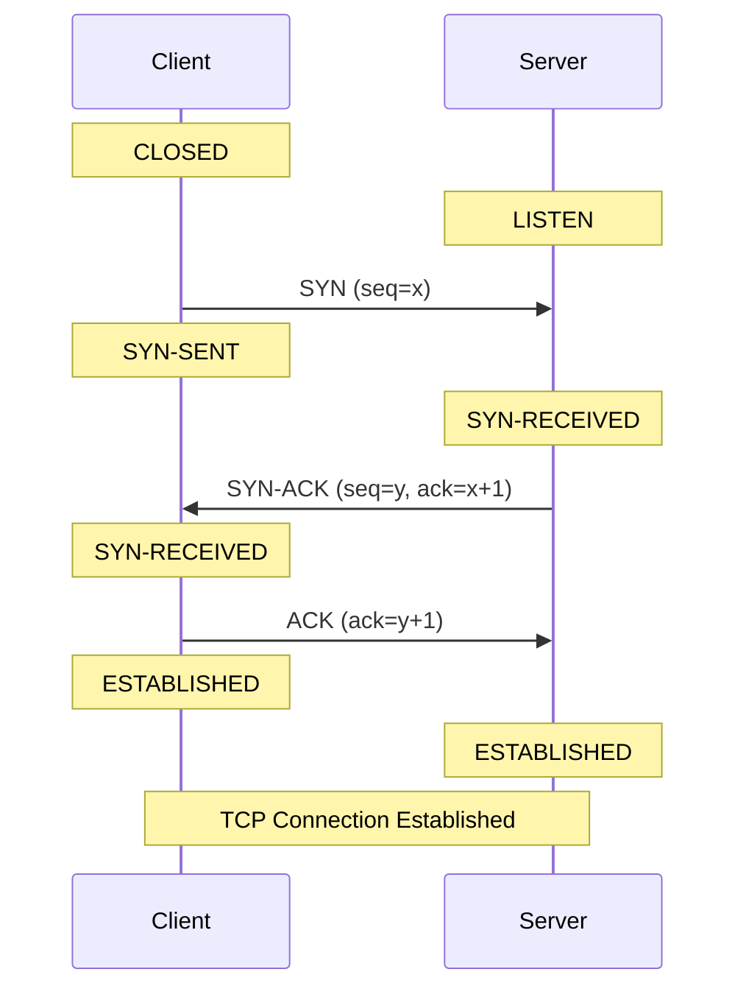
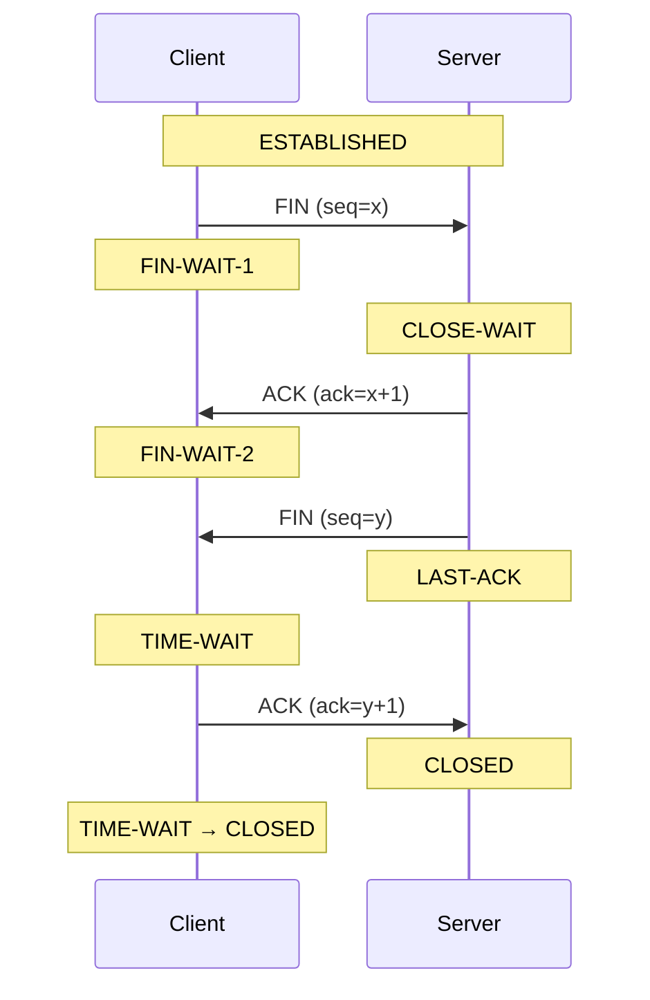

## Definition

**TCP (Transmission Control Protocol)** is a network protocol used to establish a reliable connection between two devices and deliver data correctly over an IP network.

## Three-Way Handshake

The three-way handshake establishes a TCP connection between a client and server.



### Step 1 — SYN

The client sends a `SYN` packet to the server.

The client changes:

```text
CLOSED → SYN-SENT
```

The SYN packet is used to:

- Request a TCP connection
    
- Synchronize sequence numbers
    
- Tell the server the client's initial sequence number

Example:

```text
SYN
seq = 1000
```

### Step 2 — SYN-ACK

The server receives the SYN and responds with `SYN-ACK`.

```text
Client                         Server
  │──── SYN, seq=1000 ─────────->│
  │                              │
  │<── SYN-ACK ─────────────────-│
  │    seq=5000                  │
  │    ack=1001                  │
```

The server changes:

```text
LISTEN → SYN-RECEIVED
```

The server's response contains:

```text
SYN
seq = y

ACK
ack = x + 1
```

Why `x + 1`?

Because the `SYN` consumes one sequence number.

For example:

```text
Client SYN:
seq = 1000

Server:
ack = 1001
```

This means:

> I received your SYN with sequence number 1000, and I expect the next sequence number to be 1001.

### Step 3 — ACK

The client sends the final ACK.

The client changes to:

```text
ESTABLISHED
```

The server also changes to:

```text
ESTABLISHED
```

The TCP connection is now ready for data transfer.

## Four-Way TCP Termination

TCP normally uses a four-step exchange to terminate a connection because TCP is **full-duplex**.

Each side has its own direction of data transmission.

Therefore:

```text
Client → Server
```

and

```text
Server → Client
```

are closed independently.



### Step 1 — FIN

The client wants to close its sending direction.

It sends:

```text
FIN
```

The client changes:

```text
ESTABLISHED → FIN-WAIT-1
```

The server receives the FIN and changes:

```text
ESTABLISHED → CLOSE-WAIT
```

### Step 2 — ACK

The server acknowledges the FIN.

The client changes:

```text
FIN-WAIT-1 → FIN-WAIT-2
```

The server remains:

```text
CLOSE-WAIT
```

This means:

> The remote side has closed its sending direction, but the local application has not necessarily closed yet.

### Step 3 — Server FIN

When the server's application is ready to close, the server sends its own FIN.

The server changes:

```text
CLOSE-WAIT → LAST-ACK
```

The client changes:

```text
FIN-WAIT-2 → TIME-WAIT
```

### Step 4 — Final ACK

The client sends the final ACK.

The server changes:

```text
LAST-ACK → CLOSED
```

The client remains in:

```text
TIME-WAIT
```

and eventually becomes:

```text
CLOSED
```

## TCP States

### States

TCP defines a number of connection states.

|   # | TCP State      | Meaning                                                                            |
| --: | -------------- | ---------------------------------------------------------------------------------- |
|   1 | `CLOSED`       | No connection exists                                                               |
|   2 | `LISTEN`       | Server is waiting for incoming connections                                         |
|   3 | `SYN-SENT`     | Local side sent `SYN` and is waiting for `SYN-ACK`                                 |
|   4 | `SYN-RECEIVED` | `SYN` received, `SYN-ACK` sent, waiting for final `ACK`                            |
|   5 | `ESTABLISHED`  | Connection is established and data can be transferred                              |
|   6 | `FIN-WAIT-1`   | Local side sent `FIN`, waiting for `ACK` or `FIN`                                  |
|   7 | `FIN-WAIT-2`   | Local `FIN` was acknowledged; waiting for peer's `FIN`                             |
|   8 | `CLOSE-WAIT`   | Peer sent `FIN`; local application has not closed yet                              |
|   9 | `CLOSING`      | Both sides sent `FIN`; waiting for final `ACK`                                     |
|  10 | `LAST-ACK`     | Local side sent `FIN` after receiving peer's `FIN`; waiting for `ACK`              |
|  11 | `TIME-WAIT`    | Waiting before fully closing to prevent delayed packets affecting a new connection |

#### LISTEN

The application is listening for incoming connections.

Example:

```text
0.0.0.0:8080
```

This means a process may be accepting connections on TCP port `8080`.

Useful for checking:

- Is the service running?
    
- Is the port listening?
    
- Is the application bound to the expected address?

#### ESTABLISHED

The TCP connection is active.

Example:

```text
10.10.1.10:8080
        ↕
10.10.1.20:52341
```

A high number of `ESTABLISHED` connections may indicate:

- High traffic
    
- Many clients
    
- Long-lived connections
    
- Connection leaks
    
- Application connection-pool issues

The number itself is not necessarily an error.

#### TIME-WAIT

The connection has been closed, but the local TCP stack is waiting before completely removing the connection.

A large number may occur when:

- A server creates many short-lived connections.
    
- The local host frequently acts as the active closer.
    
- Applications frequently create new TCP connections.

High number time-wait doesn't automatically mean the system is broken.

You should investigate whether the number is:

- Increasing continuously
    
- Consuming local ephemeral ports
    
- Causing connection failures

#### CLOSE-WAIT

The remote side has already sent `FIN`, but the local application has not closed its side.

This state is particularly useful for finding **application-side connection leaks**.

If `CLOSE-WAIT` keeps increasing, investigate the application.

> [!warning]  
> A large or continuously increasing number of `CLOSE-WAIT` connections often indicates that the application is not properly closing sockets.

#### SYN-SENT

The local machine sent a SYN but has not received the expected SYN-ACK.

Possible causes include:

- Remote server unavailable
    
- Firewall dropping packets
    
- Network connectivity problems
    
- Incorrect routing
    
- Server overloaded
    
- Port filtering

#### SYN-RECEIVED

The server received a SYN and responded with SYN-ACK but has not received the client's final ACK.

A large number can sometimes indicate:

- Network problems
    
- Client problems
    
- Firewall behavior
    
- SYN-flood attacks
    
- Backlog exhaustion

### How to count

1. show all TCP connections

```bash
ss -ant
```

2. show only listening TCP ports

```bash
ss -lnt
```

3. show ${status} TCP connections

```bash
ss -Htan state ${status}
```

4. count TCP connections by state

```bash
ss -ant | awk 'NR>1 {print $1}' | sort | uniq -c | sort -nr
```

Example output:

```text
1500 ESTAB
 800 TIME-WAIT
 120 CLOSE-WAIT
   5 LISTEN
   2 SYN-SENT
```

5. count connections by local IP for a specific TCP state, removing the port

```bash
ss -Htan state ${tcp_status} | awk '{print $4}' | sed 's/:[^:]*$//' | sort | uniq -c | sort -nr | head -20
```

For example:

```bash
tcp_status=ESTAB
```

This can produce something like:

```text
500 10.10.1.20
300 10.10.1.21
120 10.10.1.22
```

6. count connections by local IP:Port for a specific TCP state

```bash
ss -Htan state ${tcp_status} | awk '{print $4}' | sort | uniq -c | sort -nr | head -30
```

Example:

```text
500  10.10.1.20:8080
300  10.10.1.20:8443
120  10.10.1.20:3306
```

7. Count connections by local IP:Port across all TCP states

```bash
ss -Htan | awk '{print $4}' | sort | uniq -c | sort -nr | head -20
```

Example:

```text
1200  10.10.1.20:8080
 800  10.10.1.20:8443
 300  10.10.1.20:3306
```

### State Monitoring

For general Linux monitoring, these are especially useful:

```text
ESTABLISHED
TIME-WAIT
CLOSE-WAIT
SYN-SENT
SYN-RECV
```

A practical monitoring strategy is:

```text
TCP state count
       │
       ├── ESTABLISHED
       │      └── Connection load
       │
       ├── TIME-WAIT
       │      └── Connection churn
       │
       ├── CLOSE-WAIT
       │      └── Possible application leak
       │
       ├── SYN-SENT
       │      └── Outgoing connection problems
       │
       └── SYN-RECV
              └── Incoming connection problems
```

#### Normal / healthy

```text
LISTEN
ESTABLISHED
TIME-WAIT
```

These states are not inherently abnormal.

#### Potentially interesting

```text
CLOSE-WAIT
SYN-SENT
SYN-RECEIVED
```

These deserve investigation when their numbers are unusually high or continuously increasing.

#### Potential problem patterns

```text
CLOSE-WAIT ↑ continuously
```

Possible application connection leak.

```text
SYN-SENT ↑ continuously
```

Possible network/connectivity problem.

```text
SYN-RECEIVED ↑ continuously
```

Possible client/network issue, backlog pressure, or SYN flood.

```text
TIME-WAIT ↑ significantly
```

Possible high rate of short-lived connections or ephemeral-port pressure.

## FAQ

#### Q1. Why is the TCP handshake three-way instead of two-way

Because both sides need to confirm that they can communicate and synchronize their TCP sequence numbers.

The three steps are:

```text
Client                         Server

SYN ──────────────────────────>
     <────────────────── SYN-ACK
ACK ──────────────────────────>
```

The server needs to receive the client's final `ACK` before the connection is fully established.

In simplified terms:

```text
SYN
↓
"I want to connect."

SYN-ACK
↓
"I received your request, and I can communicate with you."

ACK
↓
"I received your response. The connection is established."
```

#### Q2. Why does SYN consume one sequence number

`SYN` and `FIN` each consume one sequence number even though they don't contain application data.

For example:

```text
Client:
SYN seq=1000

Server:
ACK ack=1001
```

The server expects the next sequence number to be:

```text
1000 + 1 = 1001
```

The same principle applies to `FIN`.

#### Q3. Why does TCP termination normally require four packets

Because TCP is **full-duplex**.

There are logically two independent directions:

```text
Client ────────────────> Server
       data direction 1

Client <──────────────── Server
       data direction 2
```

Each side needs to close its own sending direction.

Therefore:

```text
Client                         Server

FIN ──────────────────────────>
     <────────────────── ACK
     <────────────────── FIN
ACK ──────────────────────────>
```

However, TCP can sometimes combine an `ACK` and `FIN`, so you may see fewer than four actual packets.
#### Q4. What is the difference between close-wait and time-wait

This is one of the most important distinctions.

`CLOSE-WAIT`

The **peer has closed its sending side**, but the local application has not closed its socket yet.

```text
Remote
  │
  │ FIN
  ▼
Local
  │
  │ CLOSE-WAIT
  ▼
Waiting for local application to close
```

A continuously increasing `CLOSE-WAIT` count can indicate an application problem.

`TIME-WAIT`

The local side has already completed the connection termination and is waiting before completely removing the connection.

```text
FIN
 ↓
ACK
 ↓
FIN
 ↓
ACK
 ↓
TIME-WAIT
 ↓
CLOSED
```

`TIME-WAIT` is normal TCP behavior.

#### Q5. Is a high number of  TIME-WAIT connections a problem

Not necessarily.

For example:

```text
20000 TIME-WAIT
```

does not automatically mean something is wrong.

A server handling many short-lived connections can naturally create many `TIME-WAIT` sockets.

You should be more concerned if:

```text
TIME-WAIT keeps increasing
        +
ephemeral ports are being exhausted
        +
new connections start failing
```

So the important question is not:

> Is `TIME-WAIT` high?

but:

> Is `TIME-WAIT` causing a resource problem?

#### Q6. Is a high number of ESTABLISHED connections a problem

Not necessarily.

`ESTABLISHED` simply means the TCP connections are active.

For example:

```text
10000 ESTABLISHED
```

could be perfectly normal for a busy web server.

You should compare the number against:

- Normal traffic
    
- Server capacity
    
- Application configuration
    
- Connection pool size
    
- Historical values

A sudden increase may be more meaningful than the absolute number.

#### Q7. Why is CLOSE-WAIT more suspicious than TIME-WAIT

Because `CLOSE-WAIT` usually means the remote side has already closed its connection, but the local application has not finished closing its socket.

For example:

```text
Remote                         Local

FIN ──────────────────────────>
     <────────────────── ACK
                              CLOSE-WAIT
```

If the application properly handles the connection closure, it should eventually send its own `FIN`

If many connections remain in:

```text
CLOSE-WAIT
```

the application may have a socket/resource leak.

#### Q8. What does SYN-SENT mean

`SYN-SENT` means:

> The local machine sent a SYN and is waiting for the remote side's SYN-ACK.

Example:

```text
Client                         Server

SYN ──────────────────────────>
             waiting...
```

If `SYN-SENT` connections remain for a long time, investigate:

- Network connectivity
    
- Routing
    
- Firewall rules
    
- Remote server availability
    
- Remote port availability
    
- Packet filtering

#### Q9. What does SYN-RECV mean

`SYN-RECV` means:

> The server received a SYN and sent a SYN-ACK, but it has not received the client's final ACK yet.

```text
Client                         Server

SYN ──────────────────────────>
     <────────────────── SYN-ACK
                              SYN-RECV
```

A small number is normal.

A very large number can indicate:

- Network problems
    
- Client problems
    
- Backlog pressure
    
- Firewall behavior
    
- SYN-flood activity

#### Q10. Does TIME-WAIT mean the connection is still usable

No.

A `TIME-WAIT` socket represents a connection that has already been terminated.

It is kept temporarily by the TCP stack for protocol correctness.

Therefore:

```text
ESTABLISHED
```

means the connection is active, while:

```text
TIME-WAIT
```

means the connection has already been closed but is being retained temporarily.

#### Q11. Why Does TIME-WAIT Exist

`TIME-WAIT` is important for TCP reliability.

The client does **not** immediately disappear after sending the final ACK.

Instead:

```text
TIME-WAIT → CLOSED
```

after waiting for a period of time.

The purpose is mainly to:

1. Allow delayed packets from the old connection to expire.
    
2. Ensure the final ACK can be retransmitted if necessary.

Without `TIME-WAIT`, delayed packets from an old connection could potentially interfere with a new connection using the same address/port combination.

> [!important]  
> `TIME-WAIT` is **not necessarily a problem**.
> 
> A large number of `TIME-WAIT` connections can be normal on servers that create many short-lived TCP connections.


Explain "Allow delayed packets from the old connection to expire"

Suppose we have:

```
Client                         Server
10.0.0.1:50000                 10.0.0.2:80
```

The TCP connection is identified by this 4-tuple:

```
10.0.0.1:50000 → 10.0.0.2:80
```

1. The old connection

Imagine they communicate:

```
Client                              Server

10.0.0.1:50000                     10.0.0.2:80
      │─────── Packet A ───────────────->│
      │─────── Packet B ───────────────->│
      │<──────────── FIN ────────────────│
      │──────────── ACK ───────────────->│
```

The connection is now being closed.

But here's the problem:

**What if Packet B was delayed somewhere in the network?**

For example:

```
Client                              Server

Packet B ────────────────X─────────────> 
                         │
                      delayed
                         │
                         ▼
                  arrives much later
```

The old packet hasn't disappeared just because the TCP connection closed.

2. Now imagine there is NO `TIME-WAIT`

The client immediately creates another TCP connection using the **same IP and port**:

```
OLD CONNECTION

10.0.0.1:50000 → 10.0.0.2:80
        │
        │ closed
        ▼

NEW CONNECTION

10.0.0.1:50000 → 10.0.0.2:80
```

Notice something important:

**The 4-tuple is exactly the same.**

Now the delayed Packet B from the **old connection** arrives:

```
                 OLD delayed packet
                        │
                        ▼
Client ───────────────────────────────> Server
10.0.0.1:50000                       10.0.0.2:80
                                         │
                                         │
                              "Which connection
                               does this belong to?"
```

The server sees:

```
10.0.0.1:50000 → 10.0.0.2:80
```

But that's also the new connection!

So an old packet could potentially be mistaken for a packet belonging to the new connection.

3. `TIME-WAIT` solves this

This is why TCP doesn't immediately forget the old connection.

After closing, one side enters:

```
TIME-WAIT
```

For example:

```
OLD CONNECTION

10.0.0.1:50000 → 10.0.0.2:80
        │
        │ close
        ▼
    TIME-WAIT
        │
        │ wait
        │
        │ old packets have time to disappear
        ▼
      CLOSED
```

During TIME-WAIT, the system essentially says:

> **"I'm not going to immediately reuse this exact connection identity. I'll wait for a while so that old packets have time to expire."**

Then, after the waiting period:

```
OLD CONNECTION
      │
      ▼
 TIME-WAIT
      │
      │ wait
      ▼
   CLOSED
      │
      ▼
NEW CONNECTION
```

Now the possibility of an old delayed packet interfering with the new connection is greatly reduced.

4. The key idea

The important concept isn't really **"TCP waits before closing."**

It's:

> **Packets can survive in the network after the connection that created them has been closed.**

Therefore:

```
Connection closed
       │
       │ doesn't mean
       ▼
all old packets immediately disappear
```

That's the reason for TIME-WAIT.

Think of TIME-WAIT as a "cool-down period"

```
OLD CONNECTION
      │
      │ FIN / ACK
      ▼
  TIME-WAIT
      │
      │ "Let's wait until
      │  old packets are gone."
      ▼
   CLOSED
      │
      ▼
  Safe to reuse
```

This is also why, when you're troubleshooting Linux with:

```
ss -ant
```

you may see many connections like:

```
TIME-WAIT
TIME-WAIT
TIME-WAIT
TIME-WAIT
```

They aren't active connections. They're **recently closed TCP connections that are being kept around temporarily to prevent exactly this kind of problem**.
